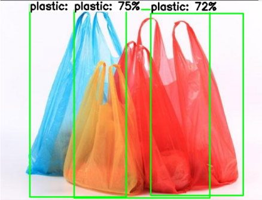

# ReCreate_ML

Unlock Creativity through all possibility!

this repo is using gathered data from https://app.roboflow.com/recreate

### Bangkit 2023 Product-based Capstone



# Object Detection API with TensorFlow 2

## Requirements

[](https://www.python.org/downloads/release/python-360/)
[](https://github.com/tensorflow/tensorflow/releases/tag/v2.2.0)
[](https://grpc.io/docs/protoc-installation/#install-using-a-package-manager)

## Installation

You can install the TensorFlow Object Detection API either with Python Package
Installer (pip) or Docker. For local runs we recommend using Docker and for
Google Cloud runs we recommend using pip.

Clone the TensorFlow Models repository and proceed to one of the installation
options.

```bash
git clone https://github.com/tensorflow/models.git
```

### Docker Installation

```bash
# From the root of the git repository
docker build -f research/object_detection/dockerfiles/tf2/Dockerfile -t od .
docker run -it od
```

### Python Package Installation

```bash
cd models/research
# Compile protos.
protoc object_detection/protos/*.proto --python_out=.
# Install TensorFlow Object Detection API.
cp object_detection/packages/tf2/setup.py .
python -m pip install --use-feature=2020-resolver .
```

```bash
# Test the installation.
python object_detection/builders/model_builder_tf2_test.py
```

## Model Pipeline

## Create Pipeline Config File

Pipeline Config provided [here](pipeline.config).

## Model Selection

We use SSD MobileNet V2 FPNLite 320x320 with pretrained coco dataset [Model can be found here](https://github.com/tensorflow/models/blob/master/research/object_detection/g3doc/tf2_detection_zoo.md).

## Training and Evaluation

```bash
#run model main
python ./models/research/object_detection/model_main_tf2.py --pipeline_config_path=<path to pipeline config> --model_dir=<path to model dir> --alsologtostderr

#evaluate model
python ./models/research/object_detection/model_main_tf2.py --pipeline_config_path=<path_to_pipeline_config> --model_dir=<path_to_model_dir> --checkpoint_dir=<path_to_checkpoint_dir> --alsologtostderr

```

## Frozen Inference

```bash
python ./models/research/object_detection/export_tflite_graph_tf2.py --pipeline_config_path <path_to_pipeline_config> --trained_checkpoint_dir <path_to_checkpoint_dir> --output_directory <path_to_output_dir> max_detections 10 --ssd_use_regular_nms True
```

## TF-Lite Convert

```bash
tflite_convert --output_file=<path_to_output_file>.tflite --graph_def_file=<path_to_output_file>.pb --input_arrays=normalized_input_image_tensor --output_arrays="TFLite_Detection_PostProcess","TFLite_Detection_PostProcess:1","TFLite_Detection_PostProcess:2","TFLite_Detection_PostProcess:3" --input_shape=1,320,320,3 --allow_custom_ops --saved_model_dir <path_to_saved_model_dir>
```

## Add Metadata To TF-Lite Model

Scripts to add metadata can be found [here](converter.py).
